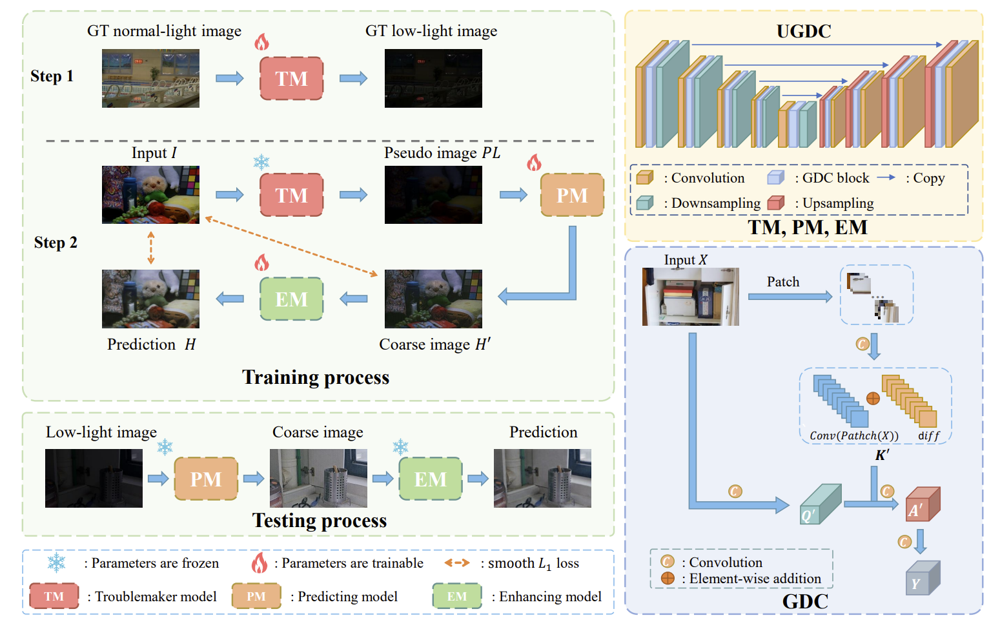

# TML

Code for the paper: ["Troublemaker Learning for Low-Light Image Enhancement"](https://arxiv.org/pdf/2402.04584.pdf)

---
<p align="center">
  
</p>


## Environments

---

```bash
torch == 1.7.1
torchvision == 0.8.2
timm == 0.6.13
```

We use **python 3.7**. Higher version is possible, 
but ensure that the above environment dependency versions match. 
For example, a higher version of *timm* may require a higher version of *python*.

## Download Pretrained Weights

---

We provide pretrained **Predicting Model (PM)** and **Enhancing Model (EM)** weights 
(i.e. *Pred.pth.tar* and *Enhance.pth.tar*). You can download [here](https://drive.google.com/drive/folders/1lWf9mTmlhZx-h3ItW_DAOJs72Ohr76H3?usp=sharing).


## Evaluation

---

- Download the pretrained PM and EM model parameters (i.e. *Pred.pth.tar* and *Enhance.pth.tar*) 
and place them in the *ckpt* folder.

- Put some low-light images in the *test* folder and run:

```bash
python evaluate.py --save_dir ./output/ --resume-Pred ./ckpt/Pred.pth.tar --resume-Enhance ./ckpt/Enhance.pth.tar ./test/
```

The results will be saved in the *output* folder.
